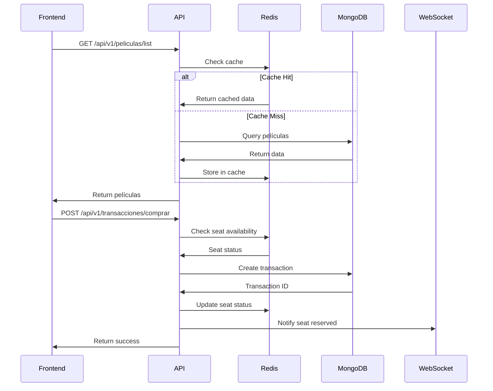
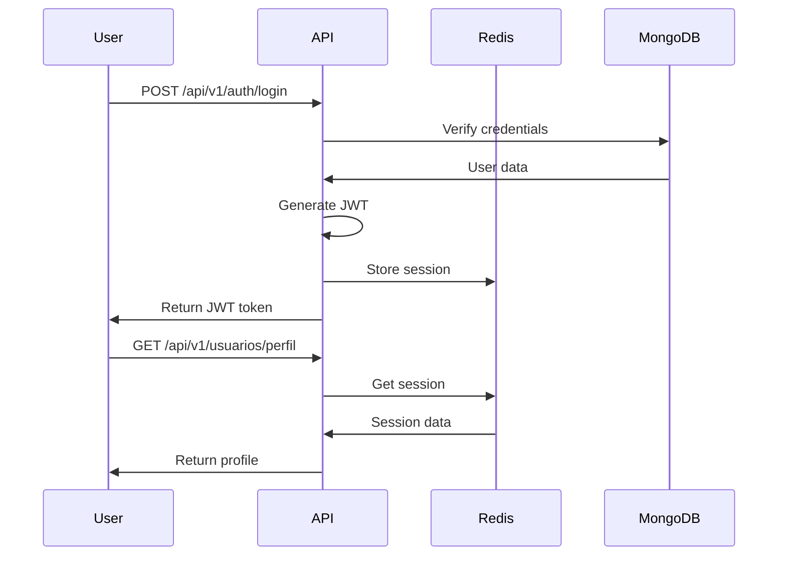

# 🎬 Cinemax API - Documentación de Arquitectura

## 📋 Tabla de Contenidos

1. [Arquitectura General](#arquitectura-general)
2. [Estructuras de Datos](#estructuras-de-datos)
3. [Flujo de Datos](#flujo-de-datos)
4. [Endpoints de la API](#endpoints-de-la-api)
5. [Diagramas](#diagramas)
6. [Tecnologías Utilizadas](#tecnologías-utilizadas)

---

## 🏗️ Arquitectura General

### Arquitectura de Sistema Distribuido

```
┌─────────────────────────────────────────────────────────────────┐
│                    FRONTEND (Netlify)                         │
│              https://upcfronted.netlify.app                  │
└─────────────────────┬─────────────────────────────────────────┘
                      │
                      ▼
┌─────────────────────────────────────────────────────────────────┐
│                CLOUDFLARE TUNNEL                              │
│         https://*.trycloudflare.com                           │
└─────────────────────┬─────────────────────────────────────────┘
                      │
                      ▼
┌─────────────────────────────────────────────────────────────────┐
│                    FASTAPI BACKEND                            │
│                    Puerto: 8000                               │
│  ┌─────────────┐ ┌─────────────┐ ┌─────────────┐            │
│  │   Auth      │ │  Películas  │ │ Transacc.   │            │
│  │  Service    │ │  Service    │ │  Service    │            │
│  └─────────────┘ └─────────────┘ └─────────────┘            │
└─────────────────────┬─────────────────────────────────────────┘
                      │
                      ▼
┌─────────────────────────────────────────────────────────────────┐
│                    REDIS CACHE                                │
│                    Puerto: 6380                               │
│  ┌─────────────┐ ┌─────────────┐ ┌─────────────┐            │
│  │   Session   │ │   Cache     │ │   Queue     │            │
│  │   Storage   │ │   Data      │ │   Emails    │            │
│  └─────────────┘ └─────────────┘ └─────────────┘            │
└─────────────────────┬─────────────────────────────────────────┘
                      │
                      ▼
┌─────────────────────────────────────────────────────────────────┐
│                    MONGODB DATABASE                           │
│                    Puerto: 27017                              │
│  ┌─────────────┐ ┌─────────────┐ ┌─────────────┐            │
│  │  Películas  │ │  Usuarios   │ │Transacciones│            │
│  │  Collection │ │  Collection │ │ Collection  │            │
│  └─────────────┘ └─────────────┘ └─────────────┘            │
└─────────────────────────────────────────────────────────────────┘
```

---

## 🗂️ Estructuras de Datos

### 1. **PILAS (Stacks) - Redis**

#### Cola de Emails (Email Queue)
```python
# Estructura: Lista en Redis (LIFO - Last In, First Out)
email_queue = [
    "email_1@example.com",
    "email_2@example.com", 
    "email_3@example.com"
]

# Operaciones:
# - LPUSH: Agregar email al inicio
# - RPOP: Procesar último email agregado
# - LLEN: Contar emails pendientes
```

**Justificación del uso de PILA:**
- **LIFO (Last In, First Out)**: Los emails más recientes se procesan primero
- **Prioridad temporal**: Emails urgentes (confirmaciones, alertas) tienen prioridad
- **Gestión de memoria**: Control automático del tamaño de la cola
- **Atomicidad**: Operaciones atómicas garantizan consistencia

#### Historial de Transacciones
```python
# Estructura: Lista en Redis (LIFO)
transaction_history = [
    {"id": "tx_003", "amount": 15000, "timestamp": "2024-01-15"},
    {"id": "tx_002", "amount": 12000, "timestamp": "2024-01-14"},
    {"id": "tx_001", "amount": 18000, "timestamp": "2024-01-13"}
]
```

**Justificación del uso de PILA:**
- **Acceso rápido a transacciones recientes**: Las más recientes están en el tope
- **Auditoría temporal**: Facilita el seguimiento cronológico
- **Rollback de operaciones**: Permite deshacer transacciones en orden inverso
- **Análisis de tendencias**: Últimas transacciones para análisis en tiempo real

### 2. **COLAS (Queues) - Redis**

#### Cola de Procesamiento de Pagos
```python
# Estructura: Lista en Redis (FIFO - First In, First Out)
payment_queue = [
    {"user_id": "user_001", "amount": 15000, "status": "pending"},
    {"user_id": "user_002", "amount": 12000, "status": "pending"},
    {"user_id": "user_003", "amount": 18000, "status": "pending"}
]

# Operaciones:
# - LPUSH: Agregar pago al inicio
# - RPOP: Procesar primer pago en cola
# - BLPOP: Esperar si no hay pagos (blocking)
```

**Justificación del uso de COLA:**
- **FIFO (First In, First Out)**: Garantiza orden cronológico de procesamiento
- **Justicia en el procesamiento**: Todos los pagos se procesan en orden de llegada
- **Prevención de pérdida de datos**: Ningún pago se pierde o se salta
- **Escalabilidad**: Múltiples workers pueden procesar la cola simultáneamente
- **Tolerancia a fallos**: Los pagos permanecen en cola si falla el procesamiento

#### Cola de Notificaciones WebSocket
```python
# Estructura: Lista en Redis (FIFO)
notification_queue = [
    {"type": "seat_reserved", "user_id": "user_001", "seat": "A5"},
    {"type": "payment_success", "user_id": "user_002", "amount": 15000},
    {"type": "movie_reminder", "user_id": "user_003", "movie": "Avengers"}
]
```

**Justificación del uso de COLA:**
- **Orden de llegada**: Las notificaciones se envían en el orden que se generaron
- **No pérdida de mensajes**: Garantiza que todas las notificaciones lleguen al usuario
- **Múltiples destinatarios**: Un mensaje puede ser enviado a múltiples usuarios
- **Persistencia temporal**: Las notificaciones se mantienen hasta ser entregadas

### 3. **LISTAS ENLAZADAS - MongoDB**

#### Lista de Películas
```python
# Estructura: Documentos en MongoDB
peliculas = [
    {
        "_id": "pel_001",
        "titulo": "Avengers: Endgame",
        "next": "pel_002",  # Referencia al siguiente
        "prev": None         # Referencia al anterior
    },
    {
        "_id": "pel_002", 
        "titulo": "Spider-Man",
        "next": "pel_003",
        "prev": "pel_001"
    }
]
```

**Justificación del uso de LISTA ENLAZADA:**
- **Navegación eficiente**: Acceso directo al siguiente/anterior elemento
- **Inserción y eliminación O(1)**: No requiere reorganizar toda la estructura
- **Flexibilidad de orden**: Permite cambiar el orden sin reindexar
- **Memoria dinámica**: Solo usa memoria para elementos existentes
- **Navegación bidireccional**: Permite recorrer hacia adelante y atrás

#### Lista de Funciones por Película
```python
# Estructura: Array en MongoDB
funciones_lista = [
    {
        "pelicula_id": "pel_001",
        "funciones": [
            {"id": "func_001", "hora": "14:00", "sala": "A"},
            {"id": "func_002", "hora": "17:00", "sala": "B"},
            {"id": "func_003", "hora": "20:00", "sala": "A"}
        ]
    }
]
```

**Justificación del uso de LISTA ENLAZADA:**
- **Orden cronológico**: Las funciones se mantienen ordenadas por hora
- **Inserción dinámica**: Nuevas funciones se insertan en el orden correcto
- **Eliminación eficiente**: Cancelaciones de funciones sin afectar otras
- **Búsqueda secuencial**: Recorrer funciones en orden de tiempo

### 4. **TABLAS HASH - Redis**

#### Cache de Sesiones de Usuario
```python
# Estructura: Hash en Redis
user_sessions = {
    "session_001": {
        "user_id": "user_001",
        "username": "john_doe",
        "role": "customer",
        "last_activity": "2024-01-15T10:30:00",
        "permissions": ["read", "write", "delete"]
    },
    "session_002": {
        "user_id": "user_002", 
        "username": "admin_user",
        "role": "admin",
        "last_activity": "2024-01-15T11:00:00",
        "permissions": ["read", "write", "delete", "admin"]
    }
}
```

**Justificación del uso de TABLA HASH:**
- **Acceso O(1)**: Búsqueda instantánea por session_id
- **Estructura de datos compleja**: Almacena múltiples campos por sesión
- **Actualizaciones parciales**: Modificar solo campos específicos sin reescribir todo
- **Expiración automática**: TTL para limpiar sesiones expiradas
- **Memoria eficiente**: Solo almacena datos necesarios

#### Cache de Datos de Películas
```python
# Estructura: Hash en Redis
movie_cache = {
    "pel_001": {
        "titulo": "Avengers: Endgame",
        "director": "Anthony Russo",
        "duracion": 181,
        "precio": 15000,
        "rating": 4.8,
        "last_updated": "2024-01-15T10:00:00"
    }
}
```

**Justificación del uso de TABLA HASH:**
- **Cache de consultas frecuentes**: Evita consultas repetidas a MongoDB
- **Actualizaciones atómicas**: Modificar campos individuales sin conflictos
- **Invalidación selectiva**: Eliminar solo campos específicos del cache
- **Serialización eficiente**: Formato compacto para datos complejos
- **Persistencia temporal**: Datos se mantienen hasta expiración

### 5. **ÁRBOLES - MongoDB**

#### Jerarquía de Géneros
```python
# Estructura: Documentos anidados en MongoDB
generos_tree = {
    "genero_raiz": "Cine",
    "subgeneros": [
        {
            "id": "accion",
            "nombre": "Acción",
            "subgeneros": [
                {"id": "superheroes", "nombre": "Superhéroes"},
                {"id": "guerra", "nombre": "Guerra"}
            ]
        },
        {
            "id": "drama", 
            "nombre": "Drama",
            "subgeneros": [
                {"id": "biografico", "nombre": "Biográfico"},
                {"id": "historico", "nombre": "Histórico"}
            ]
        }
    ]
}
```

**Justificación del uso de ÁRBOL:**
- **Jerarquía natural**: Los géneros tienen subgéneros de forma natural
- **Navegación eficiente**: Recorrer la jerarquía de forma estructurada
- **Búsqueda por niveles**: Encontrar películas por género y subgénero
- **Escalabilidad**: Fácil agregar nuevos géneros y subgéneros
- **Organización lógica**: Estructura que refleja la clasificación real

#### Árbol de Asientos por Sala
```python
# Estructura: Documentos anidados en MongoDB
sala_tree = {
    "sala_id": "sala_A",
    "filas": [
        {
            "fila": "A",
            "asientos": [
                {"numero": "A1", "estado": "disponible"},
                {"numero": "A2", "estado": "reservado"},
                {"numero": "A3", "estado": "ocupado"}
            ]
        },
        {
            "fila": "B", 
            "asientos": [
                {"numero": "B1", "estado": "disponible"},
                {"numero": "B2", "estado": "disponible"}
            ]
        }
    ]
}
```

**Justificación del uso de ÁRBOL:**
- **Estructura física**: Refleja la disposición real de asientos en el cine
- **Navegación espacial**: Recorrer filas y asientos de forma ordenada
- **Búsqueda eficiente**: Encontrar asientos disponibles por fila
- **Reservas atómicas**: Bloquear asientos sin afectar otros
- **Visualización**: Fácil representación gráfica de la sala

### 6. **GRAFOS - MongoDB**

#### Grafo de Relaciones Usuario-Película
```python
# Estructura: Documentos con referencias en MongoDB
user_movie_graph = {
    "nodes": [
        {"id": "user_001", "type": "user", "name": "John Doe"},
        {"id": "pel_001", "type": "movie", "title": "Avengers"},
        {"id": "pel_002", "type": "movie", "title": "Spider-Man"}
    ],
    "edges": [
        {"from": "user_001", "to": "pel_001", "relation": "watched"},
        {"from": "user_001", "to": "pel_002", "relation": "liked"},
        {"from": "pel_001", "to": "pel_002", "relation": "similar_genre"}
    ]
}
```

**Justificación del uso de GRAFO:**
- **Relaciones complejas**: Modelar múltiples tipos de conexiones entre entidades
- **Recomendaciones**: Encontrar películas similares basadas en preferencias
- **Análisis de patrones**: Descubrir tendencias de consumo
- **Navegación de relaciones**: Recorrer conexiones entre usuarios y películas
- **Escalabilidad**: Fácil agregar nuevos tipos de relaciones

---

## 🧮 Algoritmos y Métodos de Procesamiento

### **Métodos Recursivos**

#### 1. **Búsqueda Recursiva en Árbol de Géneros**
```python
def buscar_genero_recursivo(arbol_generos, genero_buscar, nivel=0):
    """
    Búsqueda recursiva en árbol de géneros
    Complejidad: O(n) donde n es el número de nodos
    """
    if not arbol_generos:
        return None
    
    # Buscar en el nivel actual
    for genero in arbol_generos:
        if genero['id'] == genero_buscar:
            return {'genero': genero, 'nivel': nivel}
        
        # Búsqueda recursiva en subgéneros
        if 'subgeneros' in genero:
            resultado = buscar_genero_recursivo(
                genero['subgeneros'], 
                genero_buscar, 
                nivel + 1
            )
            if resultado:
                return resultado
    
    return None
```

#### 2. **Recorrido Recursivo de Asientos**
```python
def contar_asientos_disponibles_recursivo(sala_tree, fila_actual=0, asiento_actual=0):
    """
    Contar asientos disponibles de forma recursiva
    Complejidad: O(n*m) donde n=filas, m=asientos por fila
    """
    if fila_actual >= len(sala_tree['filas']):
        return 0
    
    fila = sala_tree['filas'][fila_actual]
    
    if asiento_actual >= len(fila['asientos']):
        # Pasar a la siguiente fila
        return contar_asientos_disponibles_recursivo(sala_tree, fila_actual + 1, 0)
    
    asiento = fila['asientos'][asiento_actual]
    contador = 1 if asiento['estado'] == 'disponible' else 0
    
    # Recursión al siguiente asiento
    return contador + contar_asientos_disponibles_recursivo(
        sala_tree, fila_actual, asiento_actual + 1
    )
```

#### 3. **Generación Recursiva de QR Codes**
```python
def generar_qr_recursivo(datos, intento=1, max_intentos=3):
    """
    Generar QR con reintentos recursivos si falla
    Complejidad: O(1) por intento
    """
    if intento > max_intentos:
        raise Exception("No se pudo generar QR después de 3 intentos")
    
    try:
        qr = qrcode.QRCode(version=intento, box_size=10, border=5)
        qr.add_data(datos)
        qr.make(fit=True)
        return qr.make_image(fill_color="black", back_color="white")
    except Exception:
        # Reintento recursivo con versión diferente
        return generar_qr_recursivo(datos, intento + 1, max_intentos)
```

### **Métodos de Ordenamiento**

#### 1. **QuickSort para Películas por Rating**
```python
def quicksort_peliculas_rating(peliculas, inicio=0, fin=None):
    """
    Ordenar películas por rating usando QuickSort
    Complejidad: O(n log n) promedio, O(n²) peor caso
    """
    if fin is None:
        fin = len(peliculas) - 1
    
    if inicio < fin:
        # Particionar y obtener índice del pivote
        pivote_idx = particionar_por_rating(peliculas, inicio, fin)
        
        # Ordenar recursivamente las dos mitades
        quicksort_peliculas_rating(peliculas, inicio, pivote_idx - 1)
        quicksort_peliculas_rating(peliculas, pivote_idx + 1, fin)
    
    return peliculas

def particionar_por_rating(peliculas, inicio, fin):
    """
    Función auxiliar para QuickSort
    """
    pivote = peliculas[fin]['rating']
    i = inicio - 1
    
    for j in range(inicio, fin):
        if peliculas[j]['rating'] >= pivote:  # Orden descendente
            i += 1
            peliculas[i], peliculas[j] = peliculas[j], peliculas[i]
    
    peliculas[i + 1], peliculas[fin] = peliculas[fin], peliculas[i + 1]
    return i + 1
```

#### 2. **MergeSort para Funciones por Hora**
```python
def mergesort_funciones_hora(funciones):
    """
    Ordenar funciones por hora usando MergeSort
    Complejidad: O(n log n) siempre
    """
    if len(funciones) <= 1:
        return funciones
    
    # Dividir en dos mitades
    medio = len(funciones) // 2
    izquierda = mergesort_funciones_hora(funciones[:medio])
    derecha = mergesort_funciones_hora(funciones[medio:])
    
    # Combinar las dos mitades ordenadas
    return combinar_funciones(izquierda, derecha)

def combinar_funciones(izquierda, derecha):
    """
    Combinar dos listas ordenadas de funciones
    """
    resultado = []
    i = j = 0
    
    while i < len(izquierda) and j < len(derecha):
        if izquierda[i]['hora'] <= derecha[j]['hora']:
            resultado.append(izquierda[i])
            i += 1
        else:
            resultado.append(derecha[j])
            j += 1
    
    # Agregar elementos restantes
    resultado.extend(izquierda[i:])
    resultado.extend(derecha[j:])
    
    return resultado
```

### **Métodos de Búsqueda**

#### 1. **Búsqueda Binaria para Películas Ordenadas**
```python
def busqueda_binaria_peliculas(peliculas_ordenadas, titulo_buscar):
    """
    Búsqueda binaria en películas ordenadas por título
    Complejidad: O(log n)
    """
    izquierda, derecha = 0, len(peliculas_ordenadas) - 1
    
    while izquierda <= derecha:
        medio = (izquierda + derecha) // 2
        pelicula_medio = peliculas_ordenadas[medio]['titulo']
        
        if pelicula_medio == titulo_buscar:
            return peliculas_ordenadas[medio]
        elif pelicula_medio < titulo_buscar:
            izquierda = medio + 1
        else:
            derecha = medio - 1
    
    return None
```

#### 2. **Búsqueda Lineal con Filtros Múltiples**
```python
def busqueda_lineal_filtros(peliculas, filtros):
    """
    Búsqueda lineal con múltiples criterios
    Complejidad: O(n * m) donde n=películas, m=criterios
    """
    resultados = []
    
    for pelicula in peliculas:
        coincide = True
        
        for criterio, valor in filtros.items():
            if criterio == 'genero':
                if valor not in pelicula.get('generos', []):
                    coincide = False
                    break
            elif criterio == 'duracion_max':
                if pelicula.get('duracion_minutos', 0) > valor:
                    coincide = False
                    break
            elif criterio == 'precio_max':
                if pelicula.get('precio_base', 0) > valor:
                    coincide = False
                    break
            elif criterio == 'activa':
                if pelicula.get('activa', False) != valor:
                    coincide = False
                    break
        
        if coincide:
            resultados.append(pelicula)
    
    return resultados
```

#### 3. **Búsqueda en Profundidad (DFS) para Recomendaciones**
```python
def dfs_recomendaciones(grafo_usuario, usuario_id, profundidad_max=3, visitados=None):
    """
    Búsqueda en profundidad para encontrar películas recomendadas
    Complejidad: O(V + E) donde V=vertices, E=edges
    """
    if visitados is None:
        visitados = set()
    
    if profundidad_max == 0 or usuario_id in visitados:
        return []
    
    visitados.add(usuario_id)
    recomendaciones = []
    
    # Buscar conexiones del usuario
    for edge in grafo_usuario['edges']:
        if edge['from'] == usuario_id and edge['relation'] == 'watched':
            pelicula_id = edge['to']
            
            # Buscar películas similares
            for edge_similar in grafo_usuario['edges']:
                if (edge_similar['from'] == pelicula_id and 
                    edge_similar['relation'] == 'similar_genre'):
                    recomendaciones.append(edge_similar['to'])
            
            # Recursión para profundidad
            sub_recomendaciones = dfs_recomendaciones(
                grafo_usuario, 
                pelicula_id, 
                profundidad_max - 1, 
                visitados.copy()
            )
            recomendaciones.extend(sub_recomendaciones)
    
    return list(set(recomendaciones))  # Eliminar duplicados
```

---

## 🔄 Flujo de Datos

### 1. **Flujo de Compra de Entrada**



### 2. **Flujo de Autenticación**



---

## 📡 Endpoints de la API

### **Autenticación**
```
POST   /api/v1/auth/login
POST   /api/v1/auth/register
POST   /api/v1/auth/logout
GET    /api/v1/auth/verify
```

### **Películas**
```
GET    /api/v1/peliculas/list
GET    /api/v1/peliculas/{id}
POST   /api/v1/peliculas/buscar
GET    /api/v1/peliculas/{id}/funciones
```

### **Transacciones**
```
POST   /api/v1/transacciones/comprar
GET    /api/v1/transacciones/historial
GET    /api/v1/transacciones/{id}
POST   /api/v1/transacciones/cancelar
```

### **Usuarios**
```
GET    /api/v1/usuarios/perfil
PUT    /api/v1/usuarios/perfil
GET    /api/v1/usuarios/favoritos
POST   /api/v1/usuarios/favoritos
```

### **Métricas**
```
GET    /api/v1/metricas/ranking-peliculas
GET    /api/v1/metricas/ventas-diarias
GET    /api/v1/metricas/usuarios-activos
```

### **WebSocket**
```
WS     /ws/notifications
WS     /ws/seat-updates
```

---

## 🏛️ Diagramas

### **Diagrama de Componentes**

```
┌─────────────────────────────────────────────────────────────────┐
│                        PRESENTATION LAYER                      │
│  ┌─────────────┐ ┌─────────────┐ ┌─────────────┐            │
│  │   Frontend  │ │   Mobile    │ │   Admin     │            │
│  │   (React)   │ │   (React)   │ │   (React)   │            │
│  └─────────────┘ └─────────────┘ └─────────────┘            │
└─────────────────────┬─────────────────────────────────────────┘
                      │
                      ▼
┌─────────────────────────────────────────────────────────────────┐
│                        API LAYER                              │
│  ┌─────────────┐ ┌─────────────┐ ┌─────────────┐            │
│  │  Controllers│ │  Middleware │ │  Validators │            │
│  │  (FastAPI)  │ │  (CORS,Auth)│ │  (Pydantic) │            │
│  └─────────────┘ └─────────────┘ └─────────────┘            │
└─────────────────────┬─────────────────────────────────────────┘
                      │
                      ▼
┌─────────────────────────────────────────────────────────────────┐
│                      BUSINESS LAYER                           │
│  ┌─────────────┐ ┌─────────────┐ ┌─────────────┐            │
│  │   Services  │ │ Use Cases   │ │  Business   │            │
│  │  (Logic)    │ │ (Orchestr.) │ │   Rules     │            │
│  └─────────────┘ └─────────────┘ └─────────────┘            │
└─────────────────────┬─────────────────────────────────────────┘
                      │
                      ▼
┌─────────────────────────────────────────────────────────────────┐
│                      DATA LAYER                               │
│  ┌─────────────┐ ┌─────────────┐ ┌─────────────┐            │
│  │  Repositories│ │   Cache     │ │  External   │            │
│  │  (MongoDB)  │ │  (Redis)    │ │   APIs      │            │
│  └─────────────┘ └─────────────┘ └─────────────┘            │
└─────────────────────────────────────────────────────────────────┘
```

### **Diagrama de Base de Datos**

```sql
-- MongoDB Collections

-- Películas
peliculas {
  _id: ObjectId,
  titulo: String,
  titulo_original: String,
  sinopsis: String,
  director: String,
  actores_principales: [String],
  generos: [String],
  duracion_minutos: Number,
  clasificacion: String,
  idioma_original: String,
  subtitulos: [String],
  fecha_estreno: Date,
  fecha_disponible_desde: Date,
  fecha_disponible_hasta: Date,
  poster_url: String,
  trailer_url: String,
  precio_base: Number,
  activa: Boolean,
  created_at: Date,
  updated_at: Date
}

-- Usuarios
usuarios {
  _id: ObjectId,
  username: String,
  email: String,
  password_hash: String,
  nombre: String,
  apellido: String,
  fecha_nacimiento: Date,
  telefono: String,
  direccion: {
    calle: String,
    ciudad: String,
    estado: String,
    codigo_postal: String
  },
  rol: String,
  activo: Boolean,
  created_at: Date,
  updated_at: Date
}

-- Transacciones
transacciones {
  _id: ObjectId,
  usuario_id: ObjectId,
  pelicula_id: ObjectId,
  funcion_id: ObjectId,
  asientos: [String],
  cantidad_entradas: Number,
  precio_unitario: Number,
  precio_total: Number,
  metodo_pago: String,
  estado: String,
  fecha_transaccion: Date,
  created_at: Date,
  updated_at: Date
}

-- Funciones
funciones {
  _id: ObjectId,
  pelicula_id: ObjectId,
  sala_id: String,
  fecha: Date,
  hora: String,
  precio: Number,
  asientos_disponibles: Number,
  asientos_ocupados: [String],
  activa: Boolean,
  created_at: Date,
  updated_at: Date
}
```

---

## 🎯 **Resumen de Justificaciones de Estructuras de Datos**

### **¿Por qué cada estructura?**

#### **1. PILAS (Stacks) - Redis**
- **LIFO (Last In, First Out)**: Perfecto para emails y transacciones donde lo más reciente tiene prioridad
- **Gestión de memoria**: Control automático del tamaño, evita desbordamiento
- **Atomicidad**: Operaciones atómicas garantizan consistencia en transacciones críticas
- **Auditoría temporal**: Facilita el seguimiento cronológico y rollback de operaciones

#### **2. COLAS (Queues) - Redis**
- **FIFO (First In, First Out)**: Garantiza orden cronológico de procesamiento
- **Justicia en el procesamiento**: Todos los pagos se procesan en orden de llegada
- **Escalabilidad**: Múltiples workers pueden procesar simultáneamente
- **Tolerancia a fallos**: Los datos permanecen en cola si falla el procesamiento

#### **3. LISTAS ENLAZADAS - MongoDB**
- **Navegación eficiente**: Acceso directo al siguiente/anterior elemento
- **Inserción y eliminación O(1)**: No requiere reorganizar toda la estructura
- **Flexibilidad de orden**: Permite cambiar el orden sin reindexar
- **Memoria dinámica**: Solo usa memoria para elementos existentes

#### **4. TABLAS HASH - Redis**
- **Acceso O(1)**: Búsqueda instantánea por clave
- **Estructura de datos compleja**: Almacena múltiples campos por entrada
- **Actualizaciones parciales**: Modificar solo campos específicos
- **Expiración automática**: TTL para limpiar datos expirados

#### **5. ÁRBOLES - MongoDB**
- **Jerarquía natural**: Los géneros y asientos tienen estructura jerárquica natural
- **Navegación eficiente**: Recorrer la jerarquía de forma estructurada
- **Búsqueda por niveles**: Encontrar elementos por nivel en la jerarquía
- **Escalabilidad**: Fácil agregar nuevos nodos y ramas

#### **6. GRAFOS - MongoDB**
- **Relaciones complejas**: Modelar múltiples tipos de conexiones entre entidades
- **Recomendaciones**: Encontrar elementos similares basados en relaciones
- **Análisis de patrones**: Descubrir tendencias y comportamientos
- **Navegación de relaciones**: Recorrer conexiones entre diferentes entidades

---

## 🛠️ Tecnologías Utilizadas

### **Backend**
- **FastAPI**: Framework web moderno y rápido
- **Pydantic**: Validación de datos y serialización
- **Uvicorn**: Servidor ASGI
- **JWT**: Autenticación y autorización
- **WebSockets**: Comunicación en tiempo real

### **Base de Datos**
- **MongoDB**: Base de datos NoSQL principal
- **Redis**: Cache y almacenamiento en memoria
- **MongoDB Express**: Interfaz web para MongoDB
- **Redis Commander**: Interfaz web para Redis

### **Infraestructura**
- **Docker**: Contenedores
- **Docker Compose**: Orquestación de servicios
- **Cloudflare Tunnel**: Túnel seguro
- **Nginx**: Proxy reverso (opcional)

### **Monitoreo**
- **Prometheus**: Métricas y monitoreo
- **Grafana**: Dashboards y visualización
- **Health Checks**: Verificación de salud de servicios

### **Desarrollo**
- **Python 3.11+**: Lenguaje principal
- **Poetry**: Gestión de dependencias
- **Black**: Formateo de código
- **Flake8**: Linting
- **Pytest**: Testing

---

## 📊 Métricas y Monitoreo

### **Métricas de Rendimiento**
- Tiempo de respuesta de API
- Throughput (requests/segundo)
- Uso de memoria y CPU
- Latencia de base de datos

### **Métricas de Negocio**
- Películas más populares
- Ventas diarias/mensuales
- Usuarios activos
- Tasa de conversión

### **Alertas**
- Servicios caídos
- Alto uso de recursos
- Errores de base de datos
- Tiempo de respuesta lento

---

## 🔒 Seguridad

### **Autenticación**
- JWT tokens
- Refresh tokens
- Rate limiting
- CORS configurado

### **Autorización**
- Roles de usuario (admin, customer)
- Permisos granulares
- Validación de entrada
- Sanitización de datos

### **Protección de Datos**
- Contraseñas hasheadas (bcrypt)
- Datos sensibles encriptados
- Logs seguros
- Auditoría de transacciones

---

## 🚀 Deployment

### **Desarrollo Local**
```bash
docker-compose up -d
```

### **Producción**
```bash
# Con Cloudflare Tunnel
./scripts/setup-cloudflare-tunnel-simple.sh
```

### **Monitoreo**
```bash
# Acceder a Grafana
http://localhost:3000
# Acceder a Prometheus  
http://localhost:9090
```

---

*Documentación generada automáticamente - Cinemax API v1.0.0* 